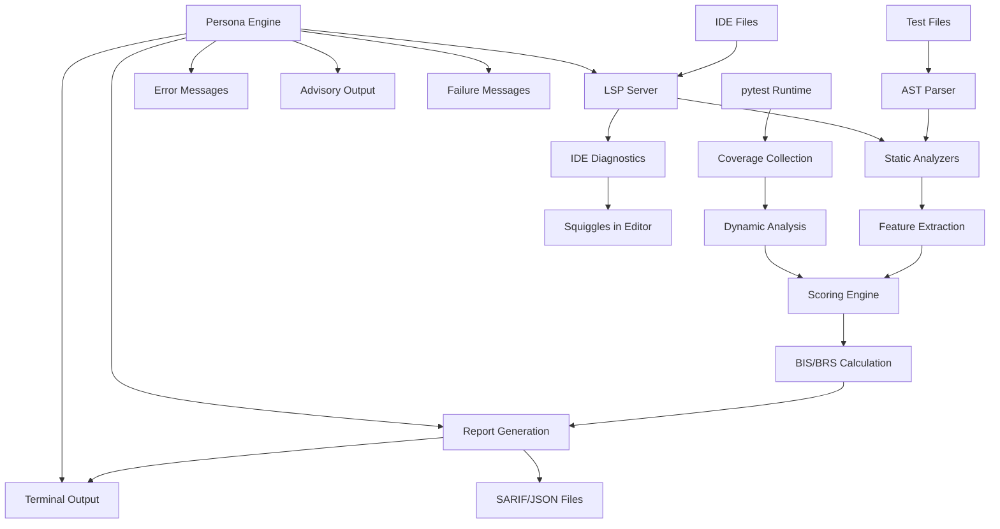

# Architecture Design

## High-Level Architecture

The project follows a hybrid architecture with three main components:

```
pytest-drill-sergeant/
├── src/pytest_drill_sergeant/
│   ├── core/                    # Shared analysis engine
│   │   ├── models.py           # Data models (Finding, Cluster, Rule)
│   │   ├── analyzers/          # Analysis modules
│   │   │   ├── ast_analyzer.py # AST-based static analysis
│   │   │   ├── clone_detector.py # Duplicate test detection
│   │   │   ├── fixture_analyzer.py # Fixture extraction suggestions
│   │   │   └── behavior_analyzer.py # WHAT vs HOW detection
│   │   ├── scoring/            # Scoring algorithms
│   │   │   ├── bis.py          # Behavior Integrity Score
│   │   │   └── brs.py          # Battlefield Readiness Score
│   │   └── reporting/          # Output generation
│   │       ├── sarif.py        # SARIF report generation
│   │       ├── json.py         # JSON report generation
│   │       └── terminal.py     # Terminal output formatting
│   ├── plugin/                 # pytest plugin integration
│   │   ├── hooks.py           # pytest hook implementations
│   │   ├── coverage.py        # Coverage integration
│   │   └── personas/          # Persona strategy implementations
│   ├── cli/                   # Standalone CLI tool
│   │   └── main.py           # CLI entry point
│   └── lsp/                   # Language Server Protocol
│       ├── server.py          # LSP server implementation
│       ├── diagnostics.py     # Diagnostic conversion
│       └── extensions/        # IDE extension stubs
```

## Core Components

### 1. Core Engine (`core/`)
**Purpose**: Shared analysis logic used by both plugin and CLI

**Key Modules**:
- `models.py`: Data structures for findings, clusters, rules, and metrics
- `analyzers/`: Static and dynamic analysis implementations
- `scoring/`: BIS and BRS calculation algorithms
- `reporting/`: Output format generators (SARIF, JSON, terminal)

### 2. Pytest Plugin (`plugin/`)
**Purpose**: Runtime integration with pytest test execution

**Key Features**:
- Per-test analysis and advisory sections
- Coverage-based dynamic duplicate detection
- Real-time persona-based feedback
- Fixture usage tracking

### 3. CLI Tool (`cli/`)
**Purpose**: Fast static analysis for pre-commit and CI

**Key Features**:
- Repo-wide static analysis
- Pre-commit hook integration
- SARIF output for PR annotations
- Performance optimized for frequent runs

### 4. LSP Server (`lsp/`)
**Purpose**: Real-time IDE integration with squiggles and diagnostics

**Key Features**:
- Real-time file analysis on open/save
- IDE diagnostic squiggles
- Configuration integration
- Multi-IDE support (VS Code, PyCharm, etc.)

## Data Flow



## Key Design Patterns

### Strategy Pattern for Personas
```python
class PersonaStrategy:
    def on_test_pass(self, test_name: str) -> str: ...
    def on_test_fail(self, test_name: str, finding: Finding) -> str: ...
    def on_summary(self, metrics: RunMetrics) -> str: ...

class DrillSergeantPersona(PersonaStrategy): ...
class SnoopDoggPersona(PersonaStrategy): ...
class MotivationalCoachPersona(PersonaStrategy): ...
```

### Observer Pattern for Analysis
```python
class AnalysisPipeline:
    def __init__(self):
        self.analyzers: List[Analyzer] = []

    def add_analyzer(self, analyzer: Analyzer):
        self.analyzers.append(analyzer)

    def analyze(self, test_file: Path) -> List[Finding]:
        findings = []
        for analyzer in self.analyzers:
            findings.extend(analyzer.analyze(test_file))
        return findings
```

### Registry Pattern for Rules
```python
class RuleRegistry:
    def __init__(self):
        self.rules: Dict[str, Rule] = {}

    def register(self, rule: Rule):
        self.rules[rule.id] = rule

    def get_enabled_rules(self, config: Config) -> List[Rule]:
        return [rule for rule in self.rules.values()
                if rule.id in config.enabled_rules]
```

## Configuration Management

Single source of truth in `pyproject.toml`:

```toml
[tool.pytest_drill_sergeant]
mode = "advisory"  # advisory | quality-gate | strict
persona = "drill_sergeant"  # drill_sergeant | snoop_dogg | coach | butler
sut_package = "myapp"  # auto-detected if not specified

[tool.pytest_drill_sergeant.budgets]
warn = 25
error = 0

[tool.pytest_drill_sergeant.rules]
enable = ["aaa-comments", "static-clones", "fixture-extract", "behavior-integrity"]
suppress = []

[tool.pytest_drill_sergeant.thresholds]
static_clone_hamming = 6
dynamic_cov_jaccard = 0.95
bis_threshold_warn = 80
bis_threshold_fail = 65

[tool.pytest_drill_sergeant.mock_allowlist]
allowed = ["requests.*", "boto3.*", "time.*", "random.*"]
```

## Performance Considerations

### Static Analysis Optimization
- AST parsing cached by file modification time
- Parallel analysis of independent test files
- Incremental analysis for changed files only

### Runtime Analysis Optimization
- Coverage collection uses pytest's built-in coverage context
- Mock assertion counting via monkeypatching (minimal overhead)
- Per-test metrics computed lazily

### Memory Management
- Large analysis results streamed to disk
- AST trees discarded after feature extraction
- Coverage data processed in batches

## Extensibility Points

1. **Custom Analyzers**: Plugin system for adding new analysis rules
2. **Custom Personas**: Easy addition of new feedback personalities
3. **Custom Reporters**: Support for additional output formats
4. **Custom Scorers**: Pluggable scoring algorithms
5. **Custom Rules**: User-defined analysis patterns

## Plugin System Architecture

### How Teams Like pytest and ruff Handle Plugins

**pytest Plugin System**:
- Uses `pytest11` entry points in `pyproject.toml`
- Hooks system with `pytest_*` functions
- Plugin discovery and loading
- Configuration integration

**ruff Plugin System**:
- Uses `ruff.rule` entry points
- AST-based rule registration
- Rule registry with priority system
- Configuration-driven enable/disable

**Our Plugin System** (inspired by both):
```python
# Entry point registration
[tool.pytest-drill-sergeant.plugins]
custom_analyzer = "my_package.plugins:CustomAnalyzer"
custom_persona = "my_package.plugins:CustomPersona"

# Plugin base classes
class DrillSergeantPlugin:
    """Base class for drill sergeant plugins"""

    def __init__(self, config: Config):
        self.config = config

    def initialize(self) -> None:
        """Called when plugin is loaded"""
        pass

    def cleanup(self) -> None:
        """Called when plugin is unloaded"""
        pass

class AnalyzerPlugin(DrillSergeantPlugin):
    """Plugin for custom analyzers"""

    @abstractmethod
    def analyze(self, file_path: Path) -> List[Finding]:
        """Analyze a file and return findings"""
        pass

    @property
    @abstractmethod
    def rule_id(self) -> str:
        """Unique identifier for this analyzer"""
        pass
```

### IDE Integration for Squiggles

**Language Server Protocol (LSP) Integration**:
```python
# LSP server for IDE integration
class DrillSergeantLSP:
    """Language Server for IDE integration"""

    def __init__(self):
        self.analyzer = AnalysisPipeline()

    async def text_document_did_open(self, params):
        """Analyze file when opened"""
        findings = self.analyzer.analyze_file(params.textDocument.uri)
        diagnostics = self.findings_to_diagnostics(findings)

        await self.publish_diagnostics(
            params.textDocument.uri,
            diagnostics
        )

    def findings_to_diagnostics(self, findings: List[Finding]) -> List[Diagnostic]:
        """Convert findings to LSP diagnostics"""
        return [
            Diagnostic(
                range=Range(
                    start=Position(finding.location[0], finding.location[1]),
                    end=Position(finding.location[0], finding.location[1] + 10)
                ),
                message=finding.message,
                severity=self.severity_to_lsp(finding.severity),
                source="pytest-drill-sergeant"
            )
            for finding in findings
        ]
```

**IDE Extension Points**:
1. **VS Code Extension**: LSP client + extension
2. **PyCharm Plugin**: IntelliJ plugin architecture
3. **Vim/Neovim**: LSP client integration
4. **Emacs**: LSP client integration

**Configuration for IDEs**:
```json
// .vscode/settings.json
{
  "pytest-drill-sergeant.enabled": true,
  "pytest-drill-sergeant.mode": "advisory",
  "pytest-drill-sergeant.persona": "drill_sergeant",
  "pytest-drill-sergeant.showSquiggles": true
}
```
